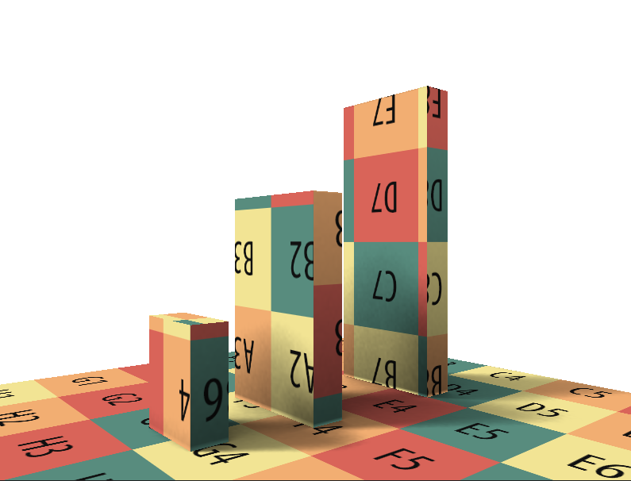
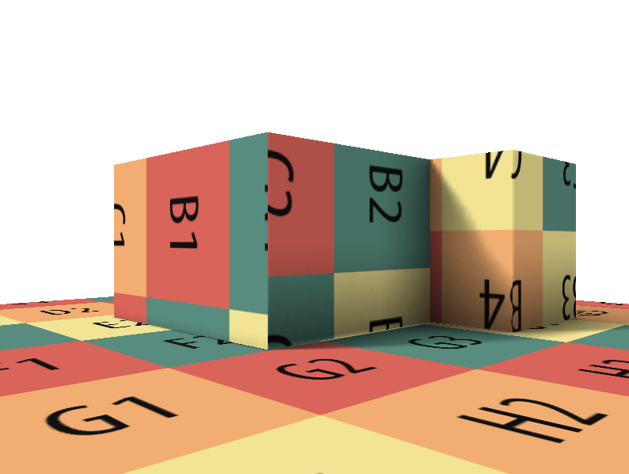
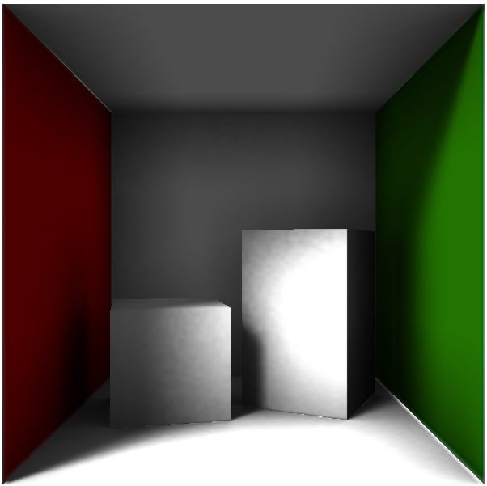

# TucanLightmapper
CPU lightmapper with simple OpenGL renderer.

## About
This lightmapper implements ray-tracing algorithm with shadows accumulation for accurate light simulation.

## Dependencies
GLM 1.0.1 https://github.com/g-truc/glm/releases/tag/1.0.1

LodePNG https://github.com/lvandeve/lodepng

Embree 4.3.2 https://github.com/RenderKit/embree